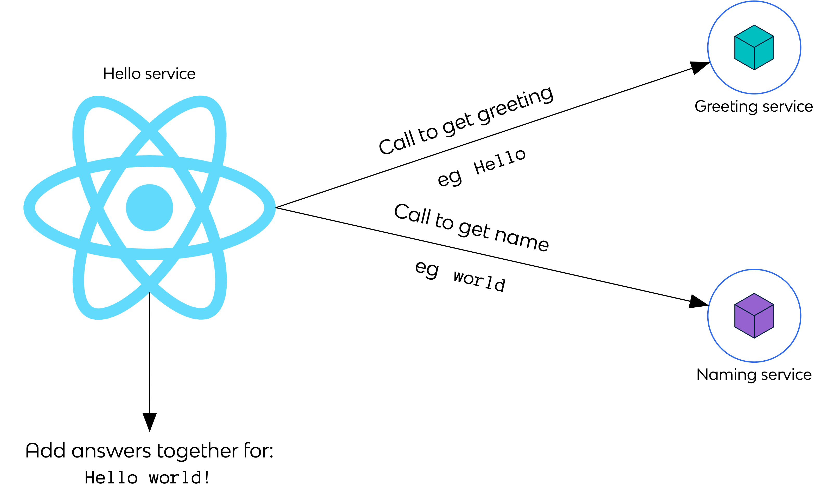

# Python web app

Proof-of-Concept (PoC) application that returns a name. It is indented to be called by another application that composes a "_Greeting name!_" output.

For example for "_Hello world!_" this app would be the one providing the "_world_".



## Commands

Since Python is an interpreted language, we need to run in an interpreted local virtual environment. For this, we use Poetry. To install Poetry:

```console
pip install poetry
```

Dependencies are defined in `pyproject.toml`, `poetry.toml`, and `poetry.lock`. TO install the dependencies:

```console
poetry install --no-dev
```

To build the application:

```console
# Nothing to build, Python is an interpreted language
```

To run the application, in the virtual environment:

```console
poetry run gunicorn -b0.0.0.0:5002 app:app
```

To run a container with the application:

```console
docker run --interactive --tty --rm \
  --publish 5002:5002 \
  YOUR_IMAGE_ID_HERE
```

Endpoints exposed by the application:

```console
# curl -v http://localhost:5002
  *   Trying ::1...
  * TCP_NODELAY set
  * Connected to localhost (::1) port 5002 (#0)
  > GET / HTTP/1.1
  > Host: localhost:5002
  > User-Agent: curl/7.64.1
  > Accept: */*
  >
  < HTTP/1.1 200 OK
  < Server: gunicorn
  < Date: Thu, 1 Apr 1000 10:10:09 GMT
  < Connection: close
  < Content-Type: application/json
  < Content-Length: 21
  < X-Reply-Service: greeter-service
  < X-Version: dev
  < Access-Control-Allow-Origin: *
  <
  * Closing connection 0

  {"greeting": "hello"}

# curl -v http://localhost:5002/status/alive
  *   Trying ::1...
  * TCP_NODELAY set
  * Connected to localhost (::1) port 5002 (#0)
  > GET /status/alive HTTP/1.1
  > Host: localhost:5002
  > User-Agent: curl/7.64.1
  > Accept: */*
  >
  < HTTP/1.1 200 OK
  < Server: gunicorn
  < Date: Thu, 1 Apr 1000 10:10:10 GMT
  < Connection: close
  < Content-Type: application/json
  < Content-Length: 38
  < X-Reply-Service: greeter-service
  < X-Version: dev
  < Access-Control-Allow-Origin: *
  <
  * Closing connection 0

  {"status": "Greeter service is alive"}

# curl -v http://localhost:5002/status/healthy
  *   Trying ::1...
  * TCP_NODELAY set
  * Connected to localhost (::1) port 5002 (#0)
  > GET /status/healthy HTTP/1.1
  > Host: localhost:5002
  > User-Agent: curl/7.64.1
  > Accept: */*
  >
  < HTTP/1.1 200 OK
  < Server: gunicorn
  < Date: Thu, 1 Apr 1000 10:10:11 GMT
  < Connection: close
  < Content-Type: application/json
  < Content-Length: 40
  < X-Reply-Service: greeter-service
  < X-Version: dev
  < Access-Control-Allow-Origin: *
  <
  * Closing connection 0

  {"status": "Greeter service is healthy"}
```
